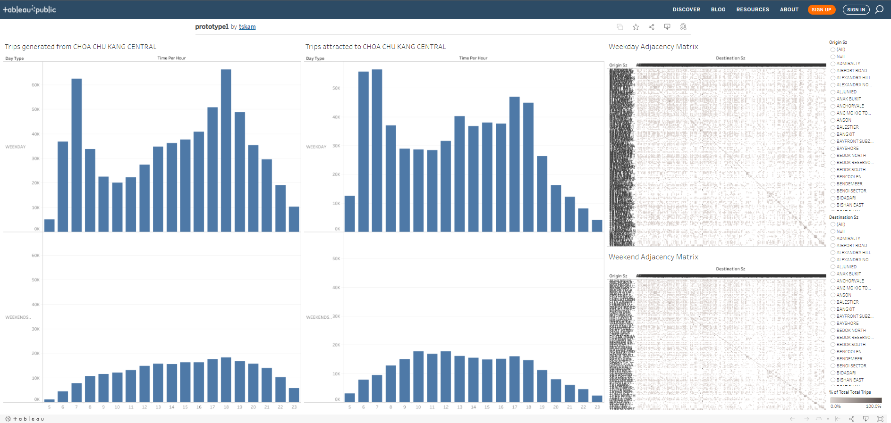
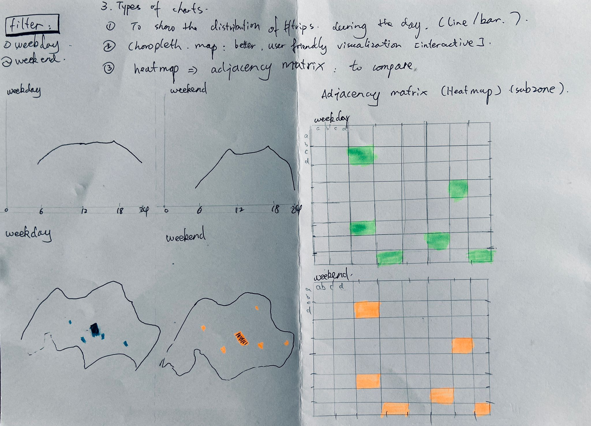

```{r setup, include=FALSE}
knitr::opts_chunk$set(echo = FALSE, out.width="300px")
```


```{r}
packages = c('tidyverse', 'readxl', 'knitr')

for(p in packages){
  if(!require(p, character.only = T)){
    install.packages(p)
  }
  library(p, character.only = T)
}
```


### 1. Critique
The original visualization is as follows: 

Definition:

**Interzonal travel** refers to the movement between different subzones.
**Intrazonal travel** refers to the transit of people between localities with the same subzones.


#### Clarity

1. **Redundant use of bar charts**: The objective of the bar charts is to show the distribution of inter- and intrazonal trips. Two charts representing origins and destinations causes confusion. 

2. **Unclear description of titles**: Neither titles of the charts delivered clear message, nor did the title of x-axis fullfil its purpose of description.

3. **The readability of Adjacency Matrix is poor** : The purpose of the Adjacency Matrix was to compare the inter- and intrazonal trips among different subzones. However, the Adjacency Matrix failed to fulfill this purpose. The black-white chart composed of thousands of data points makes it hard for users to understand. 

4. **Lack of visual aid to provide user-friendly geographical visualization**: The travels between different subzones would be best shown through maps. In the original design there lacks maps to help user better understand the numbers. 

5. **Poorly description of Tooltips**: tooltip from Adjacency Matrix "% of total trips along table" fail to provide description of the calculation, which may raise questions such as, what's the denominator of this calculation

6. **Incomplete timeline on the x-axis in the bar chart**: Although the trips during night might be few compare to working hours, yet the original design neglect those numbers and only select partial time during the day, which would impact users perception of the trips' distribution in the whole day.


#### Aesthetic

1. **Lack of rationales in designing the distribution of the areas occupied by each charts**: bar chart takes up too much of the area, whereas the names of the subzones in Adjacency Matrix all stack together.  

2. **Poor visual aid provided for understanding Adjacency Matrix**: The black-white design of the matrix poorly differentiate the data. Visual aid such as different shade of colors should be applied to increase the readability of the chart.

3. **Points on the adjacency Matrix are too small to be read**.


### 2. Alternative Design

The proposed design is as follows.


The proposed alternative visualization is trying to make adjustment from following perspectives:

#### Clarity

1. Line chart: Exclude the chart of trips regarding subzones as destinations. Keep only one chart representing trips from origin. The purpose of the chart is to show distributions of inter- and intrazonal trips covering all trips in 24 hours.

2. Adjacency Matrix: The purpose of the matrix is to show comparison of inter- and intrazonal trips in January 2022. Fill the chart with colors would help increase the readability of the matrix. 

3. Add choropeth map to further enhance the clarity of the dashboard, helping users interpret the data from a more accessible geographical perspective.

#### Aesthetic

1. Line Chart instead of Bar Chart: Since the purpose of the chart is to show changes of trips during the day, compare to Bar Chart, line chart might be better in showing the fluctuations, and takes less of the area in the dashboard.

2. Adjacency Matrix: Add color shades to help differentiate the numbers and help users compare the data. 

3. Choropeth map: Increase the accessibility of the design.


### 3. Proposed visualization

Please view the interactive visualization on [here]()


### 4.Step-by-step Guide


#### 4.1 Prepare the dataset
tableau

  
#### 4.2 Plot the chart using Tableau
**No.**|**Move**|**Action**


#### 4.3 The finalized Tableau chart.
Here is the link to the [Tableau chart]().


### 5.Observations

#### 5.1


#### 5.2


#### 5.3


#### 5.4


