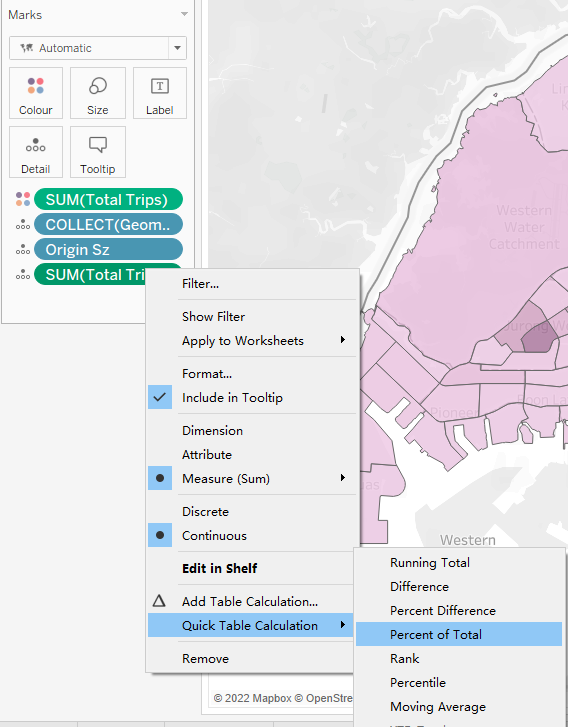
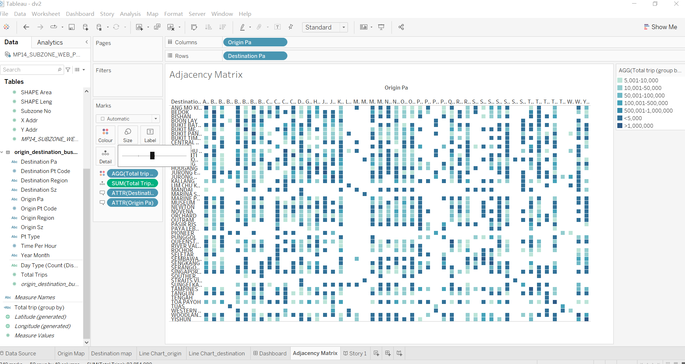

```{r setup, include=FALSE}
knitr::opts_chunk$set(echo = FALSE, fig.width = 7)
```


```{r}
packages = c('tidyverse', 'readxl', 'knitr')

for(p in packages){
  if(!require(p, character.only = T)){
    install.packages(p)
  }
  library(p, character.only = T)
}
```


### 1. Critique
The original visualization is as follows: 


Definition:

**Interzonal travel** refers to the movement between different subzones.
**Intrazonal travel** refers to the transit of people between localities with the same subzones.


#### Clarity

1. **Redundant use of bar charts**: The objective of the bar charts is to show the distribution of inter- and intrazonal trips. Two charts representing origins and destinations causes confusion. 

2. **Unclear description of titles**: Neither titles of the charts delivered clear message, nor did the title of x-axis fullfil its purpose of description.

3. **The readability of Adjacency Matrix is poor** : The purpose of the Adjacency Matrix was to compare the inter- and intrazonal trips among different subzones. However, the Adjacency Matrix failed to fulfill this purpose. The black-white chart composed of thousands of data points makes it hard for users to understand. 

4. **Lack of visual aid to provide user-friendly geographical visualization**: The travels between different subzones would be best shown through maps. In the original design there lacks maps to help user better understand the numbers. 

5. **Poorly description of Tooltips**: tooltip from Adjacency Matrix "% of total trips along table" fail to provide description of the calculation, which may raise questions such as, what's the denominator of this calculation

6. **Incomplete timeline on the x-axis in the bar chart**: Although the trips during night might be few compare to working hours, yet the original design neglect those numbers and only select partial time during the day, which would impact users perception of the trips' distribution in the whole day.


#### Aesthetic

1. **Lack of rationales in designing the distribution of the areas occupied by each charts**: bar chart takes up too much of the area, whereas the names of the subzones in Adjacency Matrix all stack together.  

2. **Poor visual aid provided for understanding Adjacency Matrix**: The black-white design of the matrix poorly differentiate the data. Visual aid such as different shade of colors should be applied to increase the readability of the chart.

3. **Points on the adjacency Matrix are too small to be read**.


### 2. Alternative Design

The proposed design is as follows.


The proposed alternative visualization is trying to make adjustment from following perspectives:

#### Clarity

1. Line chart: Exclude the chart of trips regarding subzones as destinations. Keep only one chart representing trips from origin. The purpose of the chart is to show distributions of inter- and intrazonal trips covering all trips in 24 hours.

2. Adjacency Matrix: The purpose of the matrix is to show comparison of inter- and intrazonal trips in January 2022. Fill the chart with colors would help increase the readability of the matrix. 

3. Add choropleth map to further enhance the clarity of the dashboard, helping users interpret the data from a more accessible geographical perspective.

#### Aesthetic

1. Line Chart instead of Bar Chart: Since the purpose of the chart is to show changes of trips during the day, compare to Bar Chart, line chart might be better in showing the fluctuations, and takes less of the area in the dashboard.

2. Adjacency Matrix: Add color shades to help differentiate the numbers and help users compare the data. 

3. choropleth map: Increase the accessibility of the design.


### 3. Proposed visualization

Please view the interactive visualization on [Tableau](https://public.tableau.com/app/profile/yiou3293/viz/dv2_16483948171100/Story1)

1. Interactive Dashboard contain subzone level bus travel data, which allows the users to select subzone areas from the right hand side filters. By the selection, the line chart and choropleth map will sync. 


2.Story board integrate two tabs, Adjacency Matrix which explore the inter- and intrazonal travel patterns on the planning area level, as well as the above mentioned dashboard.


### 4.Step-by-step Guide


#### 4.1 Prepare the dataset


1. Import the spatial file *MP14_SUBZONE_WEB_PL.shp*. 
2. Click add, choose csv file *origin_destination_bus__SZ_202201.csv* to link to the spatial file. Drag table to the main panel.
3. Set relationship by making subzone N = Origian Subzone, subzone N = Destination Subzone.
4. Add filters to exclude the null value in Subzones, select **custom value list**.
5. Set two filters, origin sz and destinations sz, click ok.
  
#### 4.2 Plot the choropleth map using Tableau
**No.**|**Move**|**Action**|
-|-|--- |
1|Create a new worksheet, rename to Map.Select geometry,longitude, latitute to the main table. A Singapore map is generated.||
2|Drag 'Origin Sz' to 'Detail' under Marks, drag 'Total Trips' to color||
3|Drag another ‘Total Trips’ to ‘Detail’. Right click and select ‘Quick Table Calculation’, then ‘Percent of Total’. We obtained the propotion of the origin sz in total trips in January||
4|Edit the Tooltip. Change the label to '% of  Total bus Trips in January' ||
5|Edit the Title. Change the title into 'Choropleth Map showing the volume of the bus inter- & intrazonal trips_origin' ||
6|Duplicate the sheet. Remove the origin Sz in the detail and filters, change into destination Sz. Alter the title as 'Choropleth Map showing the volume of the bus inter- & intrazonal trips_destination' ||
7|Change the color of origin as purple, destination as brown.||

#### 4.3 Plot the Line Chart using Tableau.
**No.**|**Move**|**Action**|
-|-|--- |
1|Create a new worksheet, rename to Line Chart_origin.Select Time Per Hour, change from measure to dimension||
2|Drag Time Per Hour to Columns, Day Type and Total Trips to rows.||
3|Drag total trip into color, select purple to match with the choropleth map_origin. Drag another total trip under marks, add in table calculation and conduct percent difference calculation to show the changes of % compare to the previous hour.||
4|Edit the Tooltip. Change the label to '% Difference in Total Trips to the Previous hour' ||
5|Edit the color. Select markers to 'all', change title of the sheet to 'Fluctuation of travel volumes in 24 hours'. Add Origin Sz to the filter.||
6|Duplicate the sheet. Rename the sheet as line chart_destination.Remove the origin Sz in the detail and filters, change into destination Sz. Alter the title as well. Change color to brown to match with choropleth map.||
7|Return to Origin Map sheet, Click on Filters, select 'apply to worksheets', follows by 'select worksheet', choose Line chart origin. This step is aim to create interactive filters in the dashboard.||
8|Repeat the step to establish relationship between Destination map and line chart destination. ||

#### 4.4 Plot the Adjacency Matrix using Tableau.
**No.**|**Move**|**Action**|
-|-|--- |
1|Create a new worksheet, rename to Adjacency Matrix. ||
2|Click on a new worksheet. Rename it as “Adjacency Matrix”. Click on the ‘Data’ card, and left click on ‘View Data’. Select ‘Create Calculated Field’.||
3|Add calculated area. Partitioned the data into 7 groups according to the conditions'IF SUM([Total Trips])>1000000 THEN ">1,000,000", ELSEIF SUM([Total Trips])>500000, THEN "500,001-1,000,000", ELSEIF SUM([Total Trips])>100000, THEN "100,001-500,000", ELSEIF SUM([Total Trips])>50000, THEN "50,001-100,000" ELSEIF SUM([Total Trips])>10000, THEN "10,001-50,000", ELSEIF SUM([Total Trips])>5000, THEN "5,001-10,000"ELSE "<5,000".||
4|Drag Origin SZ to Columns, Destination SZ to Row, add total trip to color.||
6|Assign mono tone color blue-teal.||
7|Observe the Chart, realize that the points are still too small to see. Decided to change to Planning area.Adjust the size of the single cells for user friendly display.||
8|Repeat the step to establish relationship between Destination map and line chart destination. ||

#### 4.5 Create dashboard and Story board on Tableau.
**No.**|**Move**|**Action**|
-|-|--- |
1|Create dashboard to set layout as follows, which allows the users to select subzone areas from the right hand side filters.By the selection, the line chart and choropleth map will sync on subzone areas. ||
2|Create Story to integrate Adjacency Matrix with the dashborad.||

### 5.Observations

#### 5.1


#### 5.2


#### 5.3


#### 5.4


